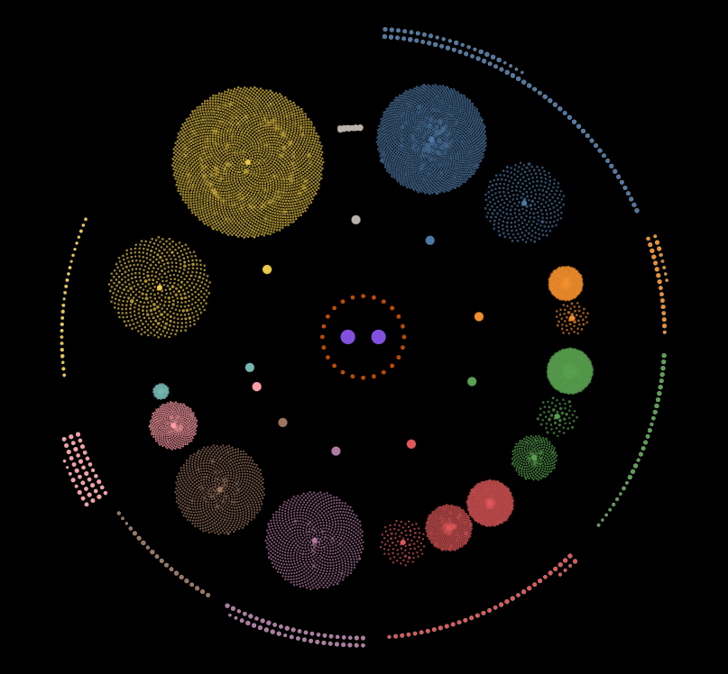
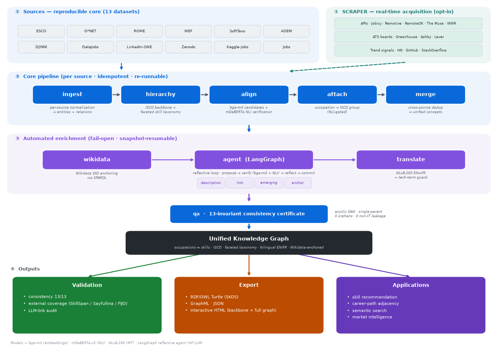

# JobKB

<p align="center">
   
</p>

JobKB is an IT-focused knowledge base, meant to back recruitment and career-path recommenders.

The core build is reproducible with no human intervention: alignment, faceted ontology, ISCO attachment, unified merge, then Wikidata QID anchoring, agentic LLM description/link generation, and bilingual label completion. Each step is automatically validated.

A multi-source web-scraper enriches the KB from job APIs, public ATS boards and emerging-tech trend signals.

## Table of Contents

- [Architecture Overview](#architecture-overview)
- [Quickstart](#quickstart)
- [Explore](#explore)
- [Sources](#sources)
- [Pipeline](#pipeline)
- [Source Adding](#source-adding)
- [Alignment and Merge](#alignment-and-merge)
- [Knowledge Base Schema](#knowledge-base-schema)
- [Validation](#validation)
- [Graph Export](#graph-export)
- [Contributing](#contributing)
- [License](#license)
- [Support](#support)


## Architecture Overview
<p align="center">
   
</p>


## Quickstart

```bash
python -m venv .venv && .venv\Scripts\activate      # Windows (source .venv/bin/activate on Unix)
pip install -r requirements.txt
cp .env.example .env        # add HF_TOKEN=hf_... (enrichment is limited without it)

python run_pipeline.py                 # full build + enrichment
python run_pipeline.py --core-only     # full build, no enrichment
python run_pipeline.py --stages qa     # integrity + consistency report over the current KB
```

See **[COMMANDS.md](COMMANDS.md)** for the full command guide.

## Explore

- **`notebooks/inspect.ipynb`** : a guided showcase of the KB (explained in french): architecture, integrity, the faceted taxonomy, interactive graph, and kb use-cases (skill recommendation, skill-gap, career similarity, etc).
- **`export/jobkb_full.html`** : the whole graph in a single page: search, click a node for its definition, domains differentiated by color.

## Sources

Scope = **core IT + managers + data**, applied consistently to every source. No
source is privileged.

| Source | Role | IT scope |
|---|---|---|
| **ISCO-08** | Neutral backbone (every source attaches to it) | sub-major 25 & 35 + minor 133 |
| **ESCO** | Occupations, skills, relations | iscoGroup 25/35/133 + all digital/digComp skills |
| **ONET** | IT occupations + technology tools | SOC 15-12xx + 15-2051 + 11-3021 |
| **NOC 2021** | Bilingual EN/FR occupations | minors 2122/2123 + 20012, 21211, 21311, 2222x |
| **ROME** | French occupations + skills (cross-lingual) | domain M18 + data/CDO codes |
| **SFIA 9** | Skills only — professional IT competency framework | 95 IT-scoped skills |
| **CSO 3.5** | Skills only — Computer Science Ontology subset | ~530 IT topics (superTopicOf, depth≤2, balanced) |
| **Lightcast Open Skills** | Skills only | IT category (17.0) ≈ 5,240 skills |
| **Kaggle technical skills dataset** | Skills only | 528 skills, 9 IT categories |
| **e-CF 4.0** | Skills only — EU e-Competence Framework | 41 ICT competences |
| **Soft skills dataset** | Skills only — recruiter-vocabulary soft skills | 22 noun-form soft skills |
| **WEF Global Skills Taxonomy** | Skills only — soft-skill standard | 47 soft skills, 5 sub-domains; 16 core → transversal |
| **IT soft-skills taxonomy** | Skills only — comprehensive IT soft skills | 38 new soft skills; 10 core → transversal |
| **ADEM** | Relations only — real vacancy demand | weighted demand edges on M18* occupations |
| **Job postings** | Relations only | role→skill demand edges |
| **data_jobs** | Hybrid — 785k postings | harvests ~50 tools + large-scale demand |
| **zenodo** | Hybrid — 17.9k SO postings | 55 tools + demand (hard & soft) |
| **Djinni** | Relations only — 142k IT postings | demand across 15 occupations |
| **LinkedIn SWE** | Relations only — 9.4k SWE postings | demand → software-developer family |
| **Kaggle job-skill-set** | Relations only — 240 IT postings | demand for IT support/PM/manager roles |
| **Emerging roles** | Occupations absent from ESCO/O*NET | additioanl roles (Analytics/MLOps/BI/Data-Gov/etc), ISCO-attached |

**Note :** Skills-only sources contribute only to skills (`contributes_occupations=False`), so they skip ISCO attachment: their skills are classified into the ontology, aligned/merged with the existing vocabulary, and reach occupations transitively. Relation-only sources add weighted `demand` occupation→skill edges between existing entities (no new nodes). The soft branch has a real structure (five WEF-aligned sub-domains + a catch-all) and an IT-relevance filter (`relevance.is_non_it_soft`) that prunes abilities and non-IT ESCO life-skills in order to keep the branch IT-focused.

## Pipeline

```
src/
  config.py        # paths, schema, IT scope per source, model ids, tunables
  common.py        # deterministic ids, label normalization, idempotent CSV IO, provenance
  ingest/          # isco, esco, onet, noc, rome ... (each IT-filtered)
  sources/         # pluggable source framework: base + registry + per-source loaders
  hierarchy.py     # faceted ontology: skill -> category -> domain -> type + occupation -> domain facet
  relevance.py     # automatic IT-relevance + anti-noise gate at ingestion (for additional sources)
  align/           # candidates (embeddings) -> verify (NLI) + match_key dedup -> attach (ISCO)
  merge.py         # unified concept clustering / de-duplication
  wikidata.py      # QID anchoring + authoritative descriptions/aliases (enrichment)
  llm.py           # HF LLM descriptions / inferred links / emerging tech (one-shot enrichment)
  agent/           # LangGraph agentic enrichment
  translate.py     # bilingual EN/FR label completion (enrichment)
  validation/      # consistency invariants + external coverage + LLM-link audit
  export/          # graph export: RDF/OWL Turtle + GraphML + JSON + HTML
  incremental.py   # add/remove a source without a full rebuild
  pipeline.py      # orchestrator + QA/integrity report
run_pipeline.py    # CLI entry point
notebooks/inspect.ipynb   # verifying and showcasing the kb
```

Core stages are `ingest → hierarchy → align → attach → merge → qa`, each one is  idempotent and runnable against the existing kb.

On a full build the post-merge enrichment stages run automatically:
`… → merge → `**`wikidata → agent → translate`**` → qa` (Wikidata first — its QIDs/descriptions feed the rest; the `agent` stage in a one-shot). Each enrichment
stage is fail-open and snapshot-resumable.

```bash
python run_pipeline.py --stages merge            # re-derive unified concepts
python run_pipeline.py --from align              # align -> attach -> merge -> qa
python run_pipeline.py --stages ingest --source ESCO   # re-ingest a specific source
python run_pipeline.py --list-stages
```

A full build takes some hours on CPU, and verified by mDeBERTa NLI models (~2 s/pair — the models review every merge, an accuracy-over-speed trade-off). bge-m3 embeddings are
disk-cached so a threshold-only rebuild can reuse them.

## Source Adding

A source is added to an existing KB without a full rebuild, it is ingested, standardized, aligned against the existing entities, attached to ISCO, and finally merged:

```bash
python run_pipeline.py --add NAME      # incrementally add one source
python run_pipeline.py --remove NAME   # remove the source and repair the graph
python run_pipeline.py --list-sources
```

Every source is screened at ingest by the relevance/noise gate (`src/relevance.py`): malformed and confidently non-IT rows are blocked (logged to
`kb/blocked_entities.csv`). Note that built-in code-filtered taxonomies bypass it.

## Alignment and Merge

Alignment is automatic and verified by models: embedding candidate generation (bge-m3) → NLI verification (mDeBERTa on definitions for occupations) → SKOS relations + a source-neutral merge flag. `merge.py` clusters the `exactMatch` graph into unified concepts. A semantic occupation merge is triple-guarded (embedding floor + same ISCO group + mutual NLI entailment), so nothing is de-duplicated.

The taxonomy is a faceted 4-level ontology over a shared domain layer: `skill → category → domain → type (hard/soft)`, and each occupation is linked (`in_domain`) to one of the domains, so the graph is navigable `occupation ↔ domain ↔ category ↔ skill`. ISCO stays
the authoritative occupation backbone.

## Knowledge Base Schema

| File | Contents |
|---|---|
| `occupations.csv` | one row per source occupation / ISCO-group node (EN+FR labels, ISCO & source codes) |
| `skills.csv` | one row per source skill (+ type/domain/category nodes), hard/soft + IT category |
| `labels.csv` | every preferred/alt label per entity, per language |
| `occupation_skill_relations.csv` | occupation ↔ skill links (essential/optional/demand/transversal/llm_inferred) |
| `hierarchy.csv` | ISCO tree + source→ISCO attachment + skill→category→domain→type + occupation→domain facet |
| `concept_alignments.csv` | cross-source matches (SKOS relation, confidence, method, validated) |
| `unified_occupations.csv` / `unified_skills.csv` | de-duplicated unified concepts (the graph's nodes) |
| `wikidata_links.csv` | QID anchors (exact/close match, confidence score) |
| `provenance.csv` | audit trail: what each stage/source produced and when |

## Validation

This process reads over the graph and writes a validation report (`validation/report.md`). It contains three tracks:

1. **Logical-consistency certificate** : 13 graph-logic invariants (acyclicity, single-parent, ISCO reachability, no skill→skill edges, endpoint types, unified integrity, id uniqueness, …). Runs inside `qa()`, so every build is self-certified.
2. **External coverage benchmark** against three expert-annotated NER corpora (SkillSpan, Sayfullina, FIJO), exact/alias + bge-m3 semantic.
3. **LLM-connection audit** : re-validates the `llm_inferred` links (NLI + demand corroboration) and LLM descriptions.
## Graph export

Materializes the concept graph. Endpoints are remapped to unified concepts via `member_entity_ids`, and each skill links to its single authoritative category.

- **`jobkb.ttl`** — RDF/OWL Turtle (SKOS + a light JobKB ontology). Loads in Protégé/GraphDB.
- **`jobkb.graphml`** — for Gephi / Cytoscape / yEd / networkx.
- **`jobkb.json`** — generic `{meta, nodes, edges}` graph JSON for web/D3 or a custom graph-DB loader.
- **`jobkb.html`** — self-contained interactive backbone overview
  library).
- **`jobkb_full.html`** — self-contained interactive full graph (all nodes + edges), with search, click-for-definition and demand-weighted node sizing options.

## Contributing

Contributions are welcome! To contribute to JobKB, please follow these steps:

1. Fork the repository
2. Create a new  branch
3. Submit a pull request with a clear description

## License
This project is licensed under the MIT License. See the [LICENSE](LICENSE) file for more details.


## Support
If you encounter any issues or have questions, please feel free to reach out.

Your feedback and contributions are greatly appreciated!